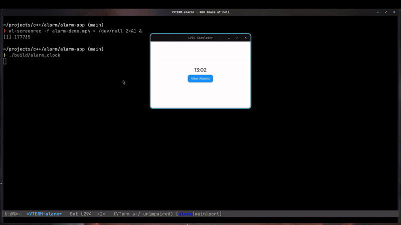

# Smart Alarm Clock
This project is a smart alarm clock that makes you solve puzzles to wake up. Math puzzles, memory games or captchas, whatever gets you up in the morning!
The project is built with **SOLID** principles in mind, meaning that most of the project is built using interfaces, so hardware is independent. Want to use a different UI? No problem! Just implement the router, the views and the presenters. Need to use a specialised way of storing alarms (e.g. on Esp-32s)? No problem! Just implement `IStorage` with your requirements. 
I wanted to make as many parts of this project hot-swappable as I could. At the moment only one UI system is built into the project: [LVGL](https://lvgl.io), the light and versatile graphics library. This can easily be deployed on something like an M5Stack device (demo coming in the future). 


# Demo 
- the following is a demo of the LVGL implementation using SDL to emulate
- showcases an alarm with the MATH puzzle 
- excuse my slow mental arithmetic :D

[watch it in full quality as an mp4](demos/alarm.mp4)


# Project Related Stuff
## Build
- provided there is a cmake build directory called build
```
cmake --build build
```

## Testing 
```
./build/tests/run_project_tests
```

### More advances flags for testing
```
ctest -V                                                        // more info
./build/tests/run_project_tests --list-test-cases               // list cases
./build/tests/run_project_tests --test-case="specific"          // specific test case
```

## Running the App (SDL lvgl simulation)
```
./build/alarm_clock
```
